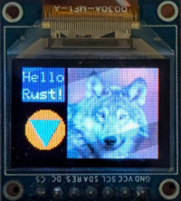

# Rust async driver for SSD1331-based displays

Uses `embedded-hal(-async)` to communicate with the display. Provides methods
to initialize the display and to send pixel data from the MCU to the
display-side framebuffer.

To generate the pixels on the MCU side, one can use `embedded-graphics` crate
with a framebuffer in the MCU RAM. That framebuffer doesn't need to be as
large as the entire display (which takes 12KB in 16-bit color mode).

## Example code

Under `examples/`, there's a demonstration firmware for STM32F103 you
can run e.g. on a Maple clone with `cargo run --release --example main`.

## Can we directly draw to the display-side framebuffer?

I tried writing a direct-to-display implementation of `DrawTarget` trait. With
that approach, drawing is necessarily synchronous, pretty slow (as sending a
single pixel requires an 8-byte transfer), and sometimes needs delays to allow
the display controller to rewrite its RAM. Overall, it's workable but slow
enough to get visible flickering when redrawing the entire screen. At least
for now, I'm going to stick with the MCU-side framebuffer.
